# Integrate the BOLT Token Family into Hodos — TDD, Demo-Driven

## Context

Hodos Browser ships a production BSV wallet: React UI → C++ CEF shell (intercepts `localhost:31301`) → **Rust** wallet daemon (Actix-web + SQLite). Hard invariant: *private keys never leave Rust; all signing in Rust*. A placeholder `frontend/src/components/wallet/TokensTab.tsx` awaits content.

The sibling `priv-chain` repo contains a working **BOLT** token protocol: a TS SDK (`ts-bolt/`), a Node wallet (`bolt-wallet/`), an SPV lib (`smb-payments/`), and precompiled `.sx.json` contracts — including three production minimal variants the demo needs.

**Goal:** demonstrate the BOLT token family interacting with real web services *through the browser wallet*, built **test-first**. The demo is the spec; every capability is justified by a demo beat and gated by a test.

### Decisions (with the user)
1. **User wallet ops = Rust-native port** into `rust-wallet` (keys stay in Rust, one daemon). C++/React gain `/bolt/*` calls like existing wallet endpoints.
2. **Demo sites = external issuers** running Node `ts-bolt` (they are separate parties; legitimately hold their own issuer keys). This shrinks the Rust surface for the demo and is realistic.
3. **Network = configurable `ChainBackend`**, runtime-selectable (`settings.chain` + `HODOS_CHAIN` env). Variants:
   - `local-node` — local SV-node **regtest** via JSON-RPC + `sendrawtransaction` + mining (reuses `bolt-wallet`'s broadcaster). **Recommended first live target**: full policy control (`-acceptnonstdtxn` accepts BOLT scripts), self-funding via mining, offline.
   - `testnet` — public BSV testnet via hosted Arcade (`arcade-v2-testnet-us-1…`). One flip away; ⚠️ **BOLT script acceptance unproven** (testnet policy may reject non-standard scripts) — verify empirically before relying on it.
   - `ttn` — teratestnet via hosted Arcade (`arcade-v2-ttn-us-1…`). **Only network proven to accept BOLT today.**
   - `main` — mainnet via hosted Arcade. BOLT ops **disabled** (policy rejects non-standard scripts).
   - `local-arcade{url}` — a local Arcade container; **deferred** (Arcade only broadcasts/tracks headers — it needs an upstream Teranode/datahub, so a local chain means also running Teranode; not worth the lift now).

   **Correctness is network-free:** Layers A′/B/C (golden vectors + forgery) require no chain, so engine work proceeds before any network is wired. Network only matters at Layer D/E and live broadcast.
4. **dApp ↔ wallet via an injected provider** `window.hodosBrowser.bolt.*` (+ existing domain-permission/auto-approve + an approval overlay + celebratory toasts).
5. **TDD throughout**: each phase is Red (write failing test) → Green (implement) → Refactor.

### Production contracts (source of truth = `priv-chain/sx/bolt/production/`)
All 7 ship in dual `.sx` / `.std.sx` form and are guarded by `sx/tests/bolt/production/{productionStd.equiv,productionDrift}.test.js`. The Rust port embeds the **compiled artifact** of each (see Layer A below), never re-deriving opcodes.

| Production contract | Demo role | Source-of-truth (`sx/tests/bolt/…`) | Lifecycle / forgery suites |
|---|---|---|---|
| **MinSimpleBolt** | base NFT (foundational; port first — simplest) | `simple/zeroData/MSBolt.opt3.sx` | `msBolt*.test.js`, `msBoltMelt`, `msBoltStd.broadcast` |
| **MinSimpleBalanceBolt** (MSBBolt) | *identity / proof-of-activity* — B1, B2 | `simple/zeroData/MinimumSimpleBalanceBolt.sx` | `minSimpleBalanceBolt.{test,spec,forgery}.js` |
| **MinSimpleDiscountBolt** | *discount coupons* — B4, B6, B7 | `simple/zeroData/MinSimpleDiscountBolt.sx` | `minSimpleDiscountBolt.{test,spec,forgery}.js` |
| **SimpleMultiBolt** | *loan money (£ IRP)* — B3, B5 | `multi/SimpleMultiBolt.sx` | `simpleMultiBolt.test.js`, `smb_green`, `smb_forgery` |
| **EventMultiBolt** | event token (follow-on) | `multi/EventMultiBolt.sx` | `multi/eventMultiBolt.test.js` |
| **EventTriggerMultiBolt** | trigger (follow-on) | `event/EventTriggerMultiBolt.sx` | `event/eventMultiBolt{Trigger,SettleTrigger}.test.js` |
| **EventListenerMultiBolt** | listener (follow-on) | `event/EventListenerMultiBolt.sx` | `event/eventMultiBolt{Listener,Forgery}.test.js` |

---

## North-Star Demo (acceptance scenario)

| # | Beat | Capability | Contract | Issuer | Test |
|---|------|-----------|----------|--------|------|
| B1 | Visit **catpicz.xyz**, need account → **mint** an identity token to `usersChosenPubKey`, **send SPV proof** to the site | wallet mint + SPV export; site verifies | MSBBolt | **user wallet** (self-issued) | E2E B1 + SPV-verify unit |
| B2 | Visit **bwanq.xxx**, reuse identity by **send-to-self** as proof of activity/ownership, send SPV proof, **auto-register to account1** | self-transfer + SPV proof + browser account binding + auto-approve | MSBBolt | user wallet | E2E B2 |
| B3 | Bank approves **£100.00 IRP** loan → **minted into a SimpleMultiBolt** to `userChosenPubKey`; wallet receives + shows currency balance | receive issuer-minted fungible; currency display | SimpleMultiBolt | **bwanq (Node issuer)** | E2E B3 + receive/decode unit |
| B4 | Visit **tackle.new**, browser **auto-creates account**; 10% coupon shown → **redeem** → coupon lands in wallet → **toasts** celebrate | receive issuer mint+transfer; toast UX | MinSimpleDiscountBolt | **tackle (Node issuer)** | E2E B4 |
| B5 | Buy a fishing rod, **apply the 10% coupon**; pay with IRP | fungible transfer (pay) + coupon consumption (melt/redeem) | SimpleMultiBolt + Discount | user wallet → tackle | E2E B5 + transfer/melt unit |
| B6 | tackle.new mints + transfers a **further 5% coupon** to the user | receive issuer mint+transfer | MinSimpleDiscountBolt | tackle (Node issuer) | E2E B6 |
| B7 | Visit **bucket.shop** (exchange), auto-register, **list the 5% coupon for sale for £3.33** | list/offer a token for sale | MinSimpleDiscountBolt | user wallet ↔ bucket | E2E B7 + listing unit |

The **Playwright E2E** that walks B1→B7 across the four sites is the top-level acceptance test.

> **Status (apps not yet built).** The four demo sites (catpicz/bwanq/tackle/bucket) and their issuer backends do **not exist yet** — they are an external dependency. The narrative above is the *target* spec, not current work. Everything that does **not** require the real sites proceeds now (Phases 0–5) and is fully testable without them; the site-dependent work (Phases 6–7) is **deferred until the apps exist**. See "Sequencing" below.

---

## Sequencing given the demo apps aren't ready

**Do now (no app dependency):** Phase 0 (ChainBackend/Arcade) → Phase 1 (sx engine + golden harness) → Phases 2–4 (MSBBolt, SimpleMultiBolt, MinSimpleDiscountBolt ports) → Phase 5 (provider API + UI), validated against a **local stub dApp page** rather than the real sites.

**Deferred until apps exist:** Phase 6 (the four real sites + Node issuer backends) and Phase 7 (full B1→B7 Playwright acceptance). When the apps land, these mostly wire the already-built+tested capabilities together.

**Bridge so the deferred work isn't blocking:** build a single **stub dApp harness** in Phase 5 — one static page that can drive every provider call (`requestMint`, `requestTransfer`, `getSpvProof`, `listToken`) and a tiny Node "issuer+verifier" reused from `bolt-wallet`/`smb-payments`. This stands in for all four sites so the provider API, SPV export/verify, and toast/auto-register UX are proven end-to-end **without** the real apps. The real sites later replace the stub page; the contracts/handlers don't change.

---

## Execution Gantt (drive to Layers A–F green; app tests excluded)

Three tracks. **Track A (chain infra)** and **Track B (contract engine)** start in parallel; **Track C (wallet surface)** joins once the chain backend and the contract ports it needs are green. The Layer-G app tests are intentionally **not** on this chart. Units are relative working-sessions, not calendar dates.

```mermaid
gantt
    title BOLT support integration — to Layers A–F green
    dateFormat X
    axisFormat %s
    section Track A · Chain infra
    P0 ChainBackend node+arcade (Layer D)    :a0, 0, 3
    section Track B · Contract engine
    P1 sx engine + golden harness (A′,B)     :b1, 0, 4
    P2 MinSimpleBolt + MSBBolt (B,C)         :b2, after b1, 3
    P3 SimpleMultiBolt (B,C)                 :b3, after b2, 4
    P4 MinSimpleDiscountBolt (B,C)           :b4, after b2, 2
    section Track C · Wallet surface
    P5a /bolt handlers + SPV (Layer E)       :c1, after a0 b3 b4, 3
    P5b Provider API + stub harness (Layer F):c2, after c1, 3
    section Gate
    Layers A–F green (loop stop)             :milestone, m1, after c2, 0
```

**Critical path:** P1 → P2 → P3 → P5a → P5b → gate. P0 (Track A) and P4 run off the critical path and absorb slack. Deferred Track G (real sites + B1→B7) attaches after the gate, only when the apps exist.

---

## TDD workflow

For every phase: **(1) Red** — add the failing test(s) named below; **(2) Green** — implement the minimum to pass; **(3) Refactor** — clean up, keep green. No production code without a failing test first. The golden-vector harness (Phase 1) is the backbone: a ported op is "done" only when its locking script, unlocking script, and txid are **byte-identical** to known-good `ts-bolt` output.

---

## Test segregation for the support integration

Tests are layered A→G. Layers **A–C are anchored on the 7 production contracts**; D–F are infra/UI; G is the deferred app acceptance. Each layer is an independent suite with its own green bar, so the support integration can be built and verified **without the demo apps** (everything except G).

| Layer | Suite (new unless noted) | Asserts | Per-contract scope | Phase |
|---|---|---|---|---|
| **A — Artifact integrity** (sx compiler) | `productionStd.equiv.test.js`, `productionDrift.test.js` *(exist — reuse as gates)* | `.std≡.sx`; snapshot≡source-of-truth (recombinants + lock/unlock args) | all 7 | 1 |
| **A′ — Artifact export → Rust embed** (new) | `sx/tests/bolt/production/artifactExport.test.js` | freezes each contract's compiled artifact (`lockOps`/`unlockOps`/`recombinants`/`lockArgs`/`unlockArgs`) to `rust-wallet/src/bolt/artifacts/<name>.json` and asserts it equals fresh compiler output | all 7 | 1 |
| **B — Golden vectors** (TS emit → Rust byte-match) | `rust-wallet/tests/bolt_golden/` + emitter `ts-bolt/scripts/emit-golden.mjs` | Rust builder reproduces **byte-identical** lock script, unlock script, txid from the same inputs | MinSimpleBolt, MSBBolt, Discount, SimpleMultiBolt (Event* follow-on) | 1–4 |
| **C — Soundness / forgery parity** (negative vectors) | `rust-wallet/tests/bolt_forgery/` (fixtures from the `*.forgery`/`smb_forgery` suites) | Rust `verifyTx` **rejects** the same counterfeits the sx forgery suites reject | MSBBolt, Discount, SimpleMultiBolt (Event* follow-on) | 2–4 |
| **D — ChainBackend** (Rust, contract-free) | `rust-wallet` `chain::arcade` + `chain::config` tests | broadcast/status/BUMP-proof roundtrip vs recorded Arcade responses; URL resolution main/ttn/testnet/local; self-track + import-funding | n/a | 0 |
| **E — Wallet handlers + SPV export** (Rust) | `rust-wallet` `/bolt/*` handler tests | mint/transfer/melt/receive per contract; `GET /bolt/proof/:id` BEEF verifies via `smb-payments` | MSBBolt, SimpleMultiBolt, Discount | 2–5 |
| **F — Provider API + stub harness** (decoupled from apps) | provider-injection + auto-approve tests; `bolt-demo/stub/` driver page | `window.hodosBrowser.bolt.*` reaches Rust with `X-Requesting-Domain`; auto-register/account binding; toasts; full provider loop via the **stub page** | all demo contracts | 5 |
| **G — Real-site + E2E** ⛔ DEFERRED (apps) | per-site contract tests; `bolt-demo/test/demo.pw.ts` | each real site performs its beat; B1→B7 acceptance on `ttn` | — | 6–7 |

**Interim green bar (no apps): A, A′, B, C, D, E, F all pass.** Layer G is the final acceptance once the apps exist.

---

## Ralph-loop to completion (Layers A–F; app tests excluded)

Drive the backlog below autonomously with the **`ralph-loop:ralph-loop`** skill. The loop owns one mutable state file, `development-docs/BOLT/PROGRESS.md` (seeded from this backlog on first run); each iteration ticks exactly one box.

**Loop goal (the prompt the loop repeats):**
> "Open `development-docs/BOLT/PROGRESS.md`. Pick the first unchecked, unblocked task whose dependencies are all checked. Write its failing test first (Red), implement the minimum to pass (Green), run that task's layer suite, then commit and tick the box. Stop when every box is ticked and Layers A,A′,B,C,D,E,F are all green. Never create or touch Layer-G (real-site / Playwright) work."

**Per-iteration protocol:** select next eligible task → **Red** (add the named failing test) → **Green** (implement) → run the layer suite (`cargo test bolt_golden|bolt_forgery`, `chain::*`, `npx jest production`, etc.) → `git commit` (one per green task) → tick the box in `PROGRESS.md`.

**Backlog (ordered; dependencies in brackets):**

*Track A · Chain infra (parallel with Track B)*
- [ ] **D-1** `ChainBackend` enum + `from_settings` resolves `local-node/testnet/ttn/main` (+ `HODOS_CHAIN`); `Broadcaster`/`ProofSource`/`HeaderSource` traits — unit test
- [ ] **D-2a** `node.rs` (default): SV-node RPC `sendrawtransaction` + `generatetoaddress` + recorded-response test [D-1]
- [ ] **D-2b** `arcade.rs`: `broadcast` (`POST /tx`) + error-mapping test [D-1]
- [ ] **D-3** proof: `node` `getrawtransaction`/mined-confirmation **and** `arcade::get_tx_status` → BUMP `merklePath` fed to `beef.rs` — test [D-1]
- [ ] **D-4** route existing broadcast/proof/height through `ChainBackend`; gate WoC UTXO on `has_address_indexer` [D-2a,D-2b,D-3]
- [ ] **D-5** self-track outputs + `POST /wallet/import-funding` — test [D-4]

*Track B · Contract engine*
- [ ] **A′-1** `artifactExport.test.js` freezes the 7 compiled artifacts → `rust-wallet/src/bolt/artifacts/*.json` (gated by `productionStd.equiv`/`productionDrift`)
- [ ] **B-0** `sx_template.rs` filler + `lib.rs` boltLib helpers; MinSimpleBolt **lock-script** golden match [A′-1]
- [ ] **B-1** `emit-golden.mjs` emits lifecycle fixtures (MinSimpleBolt, MSBBolt, SimpleMultiBolt, Discount) [A′-1]
- [ ] **B-2** MinSimpleBolt mint/transfer/melt — golden byte-match [B-0,B-1]
- [ ] **B-3** MinSimpleBalanceBolt (MSBBolt) mint/transfer/self-transfer — golden byte-match [B-2]
- [ ] **C-1** MinSimpleBolt + MSBBolt forgery parity (`verifyTx` rejects) [B-3]
- [ ] **B-4** SimpleMultiBolt mint/transfer/split/merge/melt — golden byte-match [B-3]
- [ ] **C-2** SimpleMultiBolt forgery parity [B-4]
- [ ] **B-5** MinSimpleDiscountBolt mint/transfer/melt — golden byte-match [B-3]
- [ ] **C-3** Discount forgery parity [B-5]

*Track C · Wallet surface [needs D-4 + B-4 + B-5]*
- [ ] **E-1** `/bolt/{mint,transfer,melt,receive}` handlers per contract + tests
- [ ] **E-2** `GET /bolt/proof/:id` BEEF export verifies via `smb-payments`
- [ ] **F-1** inject `window.hodosBrowser.bolt.*` + domain-perm routing — test
- [ ] **F-2** `bolt-demo/stub/` page drives the full provider loop — test
- [ ] **F-3** auto-register/account binding + toasts; `useBolt.ts` + `TokensTab.tsx`

**Completion gate (loop stop):** every box ticked **and** suites `A, A′, B, C, D, E, F` green **and** no Layer-G artifact created.

**Guardrails (hard stops for the loop):**
1. Branch off `main` before the first commit; commit per green task; **never push** without explicit approval.
2. **Pause for a human** before editing `crypto/`/signing/derivation or any DB schema/migration (Hodos invariants 2–3).
3. If a task can't go green in ≤N attempts, mark it `BLOCKED: <first byte-diff>` in `PROGRESS.md` (use the `depthTable`/`wireDiff` byte-diff method from the existing `smb_*` suites) and move to the next independent task.
4. Out of scope: real demo sites, issuer backends, Playwright (`bolt-demo/test/demo.pw.ts`) — the loop must not create these.

---

## Phase 0 — `ChainBackend` (default `local-node` regtest; `testnet`/`ttn` via Arcade)
**Red:** `chain::config` test — `ChainBackend::from_settings` resolves `local-node` / `testnet` / `ttn` / `main` (+ `HODOS_CHAIN`). `chain::node` test — broadcast a P2PKH tx + mine via SV-node RPC (recorded/mock). `chain::arcade` test — round-trip status+BUMP proof from a recorded Arcade response.
**Green:**
- `rust-wallet/src/chain/{mod,node,arcade}.rs`. `ChainBackend{ LocalNode{rpc}, Testnet, Ttn, Mainnet, LocalArcade{url} }` → a `Broadcaster` + `ProofSource` + `HeaderSource` + `has_address_indexer`.
  - `node.rs`: JSON-RPC `sendrawtransaction` + `generatetoaddress` (mining) + `getrawtransaction`/`gettxout` (reuse `bolt-wallet`'s broadcaster shape).
  - `arcade.rs`: `broadcast` (`POST /tx`, octet-stream), `get_tx_status` (`GET /tx/:txid` → BUMP `merklePath`, already consumed by `beef.rs`), headers via `/chaintracks/v1/*`.
- Route existing broadcast (`handlers.rs:~8219`), proof fetch (`cache_helpers.rs`, `monitor/task_check_for_proofs.rs`), height/header (`handlers.rs:~11666`) through `ChainBackend`. Gate WoC UTXO fetch (`utxo_fetcher.rs`, `task_sync_pending.rs`) on `has_address_indexer`.
- **Funding (keep-today/improve):** today = poll WoC per-address into `outputs`, `create_action` selects. Keep WoC for `main`/`testnet`; for Arcade-only `ttn`, **self-track** outputs the wallet creates (insert at build time, confirm via `GET /tx/:txid`) + seed initial funds via `POST /wallet/import-funding` (raw faucet tx + vout, reuses output-insert path).
**Verify:** P2PKH send on `ttn` → `202` + BUMP proof stored; existing wallet tests green on `main`.

## Phase 1 — sx template engine + golden-vector harness (de-risking core)
**Red (Layers A′, B):** `artifactExport.test.js` freezes each production contract's compiled artifact to `rust-wallet/src/bolt/artifacts/<name>.json` (gated by the existing `productionStd.equiv`/`productionDrift` guards so the embed can't drift). `cargo test bolt_golden` loads fixtures from `emit-golden.mjs` (which walks the production-contract lifecycle suites: `msBolt*`, `minSimpleBalanceBolt`, `minSimpleDiscountBolt`, `simpleMultiBolt`/`smb_green`) → `{op, inputs, expected:{lockHex,unlockHex,txid,rawTxHex}}` — initially failing.
**Green:** `rust-wallet/src/bolt/sx_template.rs` — generic filler consuming an embedded artifact (`lockOps`/`unlockOps` + `recombinants`) + named-arg map → script bytes (one-time port of the `@elas_co/ts` Tx fill step). `rust-wallet/src/bolt/lib.rs` — port `boltLib` helpers (`buildOutpoint`, `getAncestorPiece[Fungible]`, `verifyTx/verifyTx2`, `splitCtx`).
**Reuse (do not re-implement):** `transaction/sighash.rs` (ForkID/BIP143 preimage), `transaction/types.rs`, `crypto/signing.rs`, `script/parser.rs`, `beef.rs`.
**Verify:** MinSimpleBolt mint locking script matches its golden fixture exactly (proves the engine before the balance/discount/fungible ports).

## Phase 2 — MSBBolt identity: mint / transfer / send-to-self + SPV export → **B1, B2**
**Red:** golden vectors for MSBBolt mint/transfer; `spv_proof` test (exported BEEF verifies via `smb-payments` verifier against an Arcade/WoC ChainTracker).
**Green:** `rust-wallet/src/bolt/msbbolt.rs` (lock-arg bytes + the unlock args, driving `sx_template`+`sighash`+`signing`); `GET /bolt/proof/:tokenId` exporting a BEEF SPV bundle.
**Verify:** mint identity NFT to a chosen pubkey on `ttn`; self-transfer; export proof that the demo site verifies.

## Phase 3 — SimpleMultiBolt: receive / transfer / melt + currency → **B3, B5**
**Red:** golden vectors for SimpleMultiBolt transfer/melt; decode test (16B LE balance + `currency`); receive test (issuer-minted token internalized into `outputs`).
**Green:** `rust-wallet/src/bolt/simple_multi.rs` (port `SimpleMultiBolt.ts` arg builders, commit→settle two-tx flow); handlers to receive + pay.
**Verify:** receive a Node-issuer-minted £100 IRP token; pay part of it with a coupon applied on `ttn`.

## Phase 4 — MinSimpleDiscountBolt: receive / transfer / redeem / list → **B4, B6, B7**
**Red:** golden vectors for discount mint/transfer/melt; `list_for_sale` unit (build a signed offer/listing artifact priced in IRP).
**Green:** `rust-wallet/src/bolt/discount.rs`; redeem path (consume coupon during a purchase); a minimal **listing** mechanism (signed sell-offer the exchange can accept — escrow/swap-intent; document the trust model for the demo).
**Verify:** receive 10%/5% coupons; redeem one on purchase; list the 5% for £3.33 on bucket.shop.

## Phase 5 — dApp Provider API + approval / auto-register / toasts (C3)
**Red:** Rust handler tests for `/bolt/dapp/*` (domain-scoped); a provider-injection test (page calls `window.hodosBrowser.bolt.*`, request reaches Rust with `X-Requesting-Domain`); auto-approve policy test.
**Green:**
- `rust-wallet/src/handlers/bolt_handlers.rs` + `/bolt` scope in `main.rs`: `requestMint`, `requestTransfer` (issuer→user receive), `getSpvProof`, `listToken`, `getTokens`; per-site **account binding** (`account1` ↔ a BRC-42-derived `usersChosenPubKey`); auto-register (silent/quick-approve in a demo mode).
- C++: add `/bolt` to `isWalletEndpoint()` (`HttpRequestInterceptor.cpp`) + a BOLT approval overlay reuse; inject `window.hodosBrowser.bolt.*` in `simple_render_process_handler.cpp`.
- React: `frontend/src/hooks/useBolt.ts`, flesh out `TokensTab.tsx` (list/mint/send/redeem/list), and **toasts** for mint/receive/redeem events (per Hodos CEF input + overlay rules).
**Stub harness (the bridge — built here, not the real sites):** `bolt-demo/stub/` — one static page exercising every provider call + a tiny Node "issuer+verifier" (reused from `bolt-wallet`/`smb-payments`) standing in for all four sites.
**Verify:** via the stub page, mint + receive + prove a token through the provider, see toasts, and bind to `account1` — proving the full provider/SPV/UX loop **without** the real apps.

## Phase 6 — Demo sites + issuer backends + SPV verify  ⛔ DEFERRED (blocked on apps)
> Not started until the four demo apps exist. The stub harness from Phase 5 already proves the underlying capabilities; this phase swaps the stub for the real sites.
**Red:** per-site contract test: issuer backend mints the right contract to a given pubkey and returns BEEF; the site verifies an incoming SPV proof (`smb-payments` verifier).
**Green:** `bolt-demo/` with static sites **catpicz.xyz / bwanq.xxx / tackle.new / bucket.shop** (served locally; navigated via the browser) + thin **Node issuer backends** reusing `bolt-wallet`/`ts-bolt` for bwanq (SimpleMultiBolt loan) and tackle (discount coupons), and `smb-payments`-based SPV verification for catpicz/bwanq.
**Verify:** each site, hit directly, performs its beat.

## Phase 7 — Full demo E2E (acceptance)  ⛔ DEFERRED (blocked on Phase 6)
**Red:** Playwright spec `bolt-demo/test/demo.pw.ts` encoding B1→B7 (extends existing patterns in `bolt-wallet/test/wallet-e2e.pw.ts` / `wallet-sim`).
**Green:** wire timing/UX so the whole journey runs; toasts + account auto-register land at the right beats.
**Verify:** one green E2E run executes the entire narrative on `ttn`.

## Engine completeness (follow-on, after demo green)
Port remaining full-suite contracts to Rust with the same golden-vector discipline: plain **SimpleBolt** (NFT), **MultiBolt** (with swap), **EventListener/EventTrigger**. Each: Red fixtures → Green builder → byte-match.

---

## Critical files
**Create:** `rust-wallet/src/chain/{mod,arcade}.rs`; `rust-wallet/src/bolt/{mod,sx_template,lib,minsimple,msbbolt,simple_multi,discount}.rs`; `rust-wallet/src/bolt/artifacts/<name>.json` (frozen compiled artifacts, Layer A′); `rust-wallet/src/handlers/bolt_handlers.rs`; `rust-wallet/tests/{bolt_golden,bolt_forgery}/`; `sx/tests/bolt/production/artifactExport.test.js`; `ts-bolt/scripts/emit-golden.mjs`; `frontend/src/hooks/useBolt.ts`; `bolt-demo/stub/` (now) and `bolt-demo/` 4 sites + issuer backends + `test/demo.pw.ts` (deferred).
**Modify:** `rust-wallet/src/main.rs` (routes, `ChainBackend` in `AppState`); `handlers.rs` (broadcast/height via ChainBackend); `cache_helpers.rs` + `monitor/task_check_for_proofs.rs` (proof source); `utxo_fetcher.rs`/`task_sync_pending.rs` (gate on indexer); `cef-native/src/core/HttpRequestInterceptor.cpp` (`isWalletEndpoint`); `cef-native/src/handlers/simple_render_process_handler.cpp` (inject `window.hodosBrowser.bolt`); `frontend/src/components/wallet/TokensTab.tsx`.
**Embed/read-only (from priv-chain):** the **compiled artifacts** of the 7 production contracts in `sx/bolt/production/*` (MinSimpleBolt, MinSimpleBalanceBolt, MinSimpleDiscountBolt, SimpleMultiBolt, EventMultiBolt, EventTriggerMultiBolt, EventListenerMultiBolt), exported via Layer A′ rather than hand-copied `.sx.json`.

## Reuse map (need → existing)
sighash preimage → `transaction/sighash.rs` · ECDSA → `crypto/signing.rs` · tx/script/varint → `transaction/types.rs` · script parse → `script/parser.rs` · SPV/BEEF/BUMP → `beef.rs`/`beef_helpers.rs` · funding+change+broadcast lifecycle → `create_action`/`sign_action` + Monitor · token keys → `crypto`+`brc42.rs`/`recovery.rs` · issuer minting (sites) → `bolt-wallet`/`ts-bolt` · SPV verify (sites) → `smb-payments/src/verifyPayment.ts`+`smbToken.ts` · E2E harness → `bolt-wallet/test/wallet-e2e.pw.ts`.

## Test pyramid (definition of done) — by segregated layer
1. **A / A′** — `productionStd.equiv` + `productionDrift` (exist) and `artifactExport` (new) keep the embedded artifacts byte-true to the production contracts.
2. **B** — `cargo test bolt_golden`: byte-identical lock/unlock/txid vs ts-bolt fixtures (per-contract, per-op gate).
3. **C** — `cargo test bolt_forgery`: Rust `verifyTx` rejects the same counterfeits the sx forgery suites reject.
4. **D** — `chain::arcade`/`chain::config`: broadcast/proof roundtrip + backend resolution, contract-free.
5. **E** — `/bolt/*` handler + SPV-export tests (BEEF verifies via `smb-payments`).
6. **F** — provider-API/auto-approve + stub-harness loop (no real apps).
7. **G** ⛔ — real-site contract tests + **Playwright B1→B7** on `ttn`. *Deferred until the demo apps exist.*

**Definition of done while apps are unavailable:** Layers **A, A′, B, C, D, E, F green** (Phases 0–5). Layer G is the final acceptance once the apps land.

Plus regression: existing BSV send on `main`; Hodos Minimal browser test.

## Biggest risks & mitigations
- **Unlock-arg / ancestor-reconstruction correctness** (pick depths) — historical BOLT pain → golden-vector harness catches every byte diff before broadcast.
- **sx template fill fidelity** (`recombinants`) → validated in Phase 1 on lock-script fixtures first.
- **Arcade ≠ ARC + no UTXO endpoint** → isolated in `arcade.rs`; UTXO gap via self-tracking + faucet import.
- **Two parties minting** (user self-issues identity; sites issue loan/coupons) → clean split: Rust = wallet ops; Node ts-bolt = site issuers.
- **Exchange "listing" trust model** → keep the demo's bucket.shop offer mechanism explicit (signed sell-offer; not a trustless atomic swap unless EventListener is brought in later).
- **DB schema** → reuse `outputs`+`baskets`(`name='bolt_tokens'`, metadata in `customInstructions`); any V25 migration gated on explicit approval (Hodos invariant).
